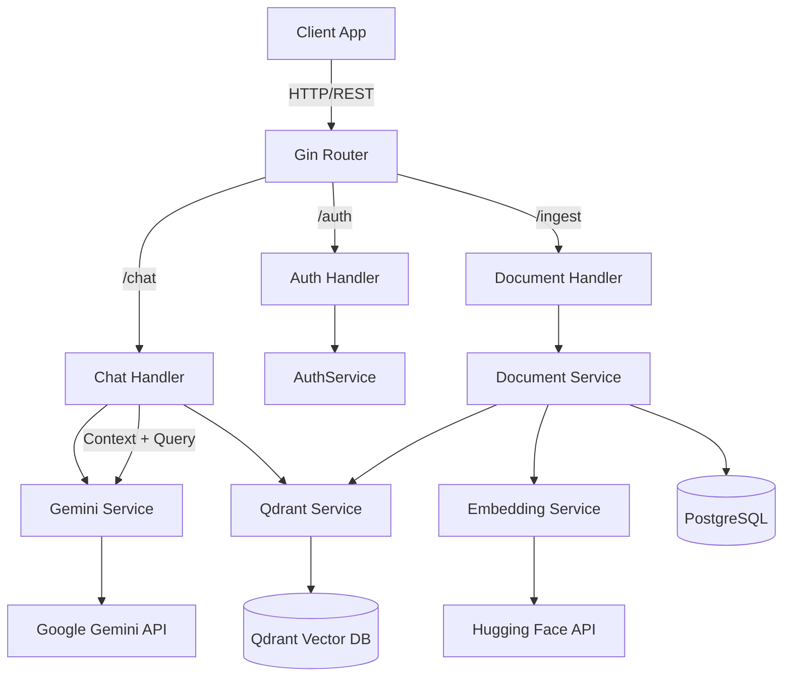

# Dory Backend

Dory Backend is a robust Go-based server designed to power a Retrieval-Augmented Generation (RAG) chat application. It provides authenticated access to document ingestion and intelligent chat capabilities using Google's Gemini AI and Qdrant vector database.

## 🏗 Architecture

The project follows a modular, layered architecture:

- **Cmd**: Entry point (`cmd/api/main.go`) initializes configuration, database connections, and routes.
- **Handlers**: (`internal/handlers`) HTTP controllers that handle request validation and response formatting.
- **Services**: (`internal/services`) Core business logic, including integrations with external APIs (Gemini, Qdrant, Hugging Face).
- **Models**: (`internal/models`) Database schemas and struct definitions.
- **Config**: (`internal/config`) Environment variable management and app configuration.



## 🚀 Features

- **Authentication**: Secure Google OAuth based authentication (Web & iOS clients). Generates JWT for session management.
- **Document Ingestion**: 
    - Support for PDF and raw text upload.
    - Automatic text chunking.
    - Vector embedding generation using `intfloat/multilingual-e5-large` via Hugging Face.
    - Storage of vectors and metadata in Qdrant.
- **Intelligent Chat (RAG)**:
    - Context-aware answers based on user-uploaded documents.
    - Uses Qdrant for semantic similarity search.
    - Uses Google Gemini 2.5 Flash for answer generation.
    - Supports multi-turn conversation logic (via context injection).

## 🛠 Tech Stack

- **Language**: Go 1.25
- **Web Framework**: Gin
- **Database**: PostgreSQL (GORM)
- **Vector Database**: Qdrant
- **AI Model**: Google Gemini 2.5 Flash (`gemini-2.5-flash`)
- **Embeddings**: `intfloat/multilingual-e5-large` (via Hugging Face Inference)
- **Authentication**: JWT, Google OAuth
- **Key Libraries**: `go-client/qdrant`, `generative-ai-go`, `ledongthuc/pdf`

## ⚙️ Configuration

The application is configured using environment variables. Create a `.env` file in the root directory:

| Variable | Description | Default |
|----------|-------------|---------|
| `PORT` | Server port | `8080` |
| `DATABASE_URL` | PostgreSQL connection string | - |
| `JWT_SECRET` | Secret key for signing JWTs | - |
| `GEMINI_API_KEY` | Google Gemini API Key | - |
| `GOOGLE_WEB_CLIENT_ID` | Google OAuth Client ID (Web) | - |
| `GOOGLE_IOS_CLIENT_ID` | Google OAuth Client ID (iOS) | - |
| `CLOUDINARY_URL` | Cloudinary Storage URL | - |
| `HUGGING_FACE_TOKEN` | Token for Hugging Face Inference API | - |
| `QDRANT_HOST` | Qdrant server host | - |
| `QDRANT_API_KEY` | Qdrant API Key | - |

## 🏃‍♂️ Getting Started

### Prerequisites

1.  **Go** (version 1.25 or later)
2.  **PostgreSQL** instance
3.  **Qdrant** instance (Cloud or Docker)
4.  **Google Cloud Project** with Gemini and OAuth enabled
5.  **Hugging Face Account** with an access token

### Installation

1.  Clone the repository:
    ```bash
    git clone https://github.com/1Kunalvats9/dory-backend.git
    cd dory-backend
    ```

2.  Install dependencies:
    ```bash
    go mod download
    ```

3.  Set up environment variables:
    ```bash
    cp .env.example .env
    # Edit .env with your credentials
    ```

4.  Run the application:
    ```bash
    go run cmd/api/main.go
    ```

The server should start on `http://localhost:8080` (or your configured port).

## 📚 API Reference

### Auth

- **POST** `/api/auth/google`: Login with Google ID token. format: `{"idToken": "..."}`. Returns JWT.

### Ingestion (Protected)

Requires `Authorization: Bearer <token>` header.

- **POST** `/api/ingest/pdf`: Upload a PDF file (multipart/form-data, key: `file`).
- **POST** `/api/ingest/text`: Upload raw text. Body: `{"text": "..."}`.

### Chat (Protected)

Requires `Authorization: Bearer <token>` header.

- **POST** `/api/chat`: Chat with your documents. Body: `{"message": "What is in my invoice?"}`.
